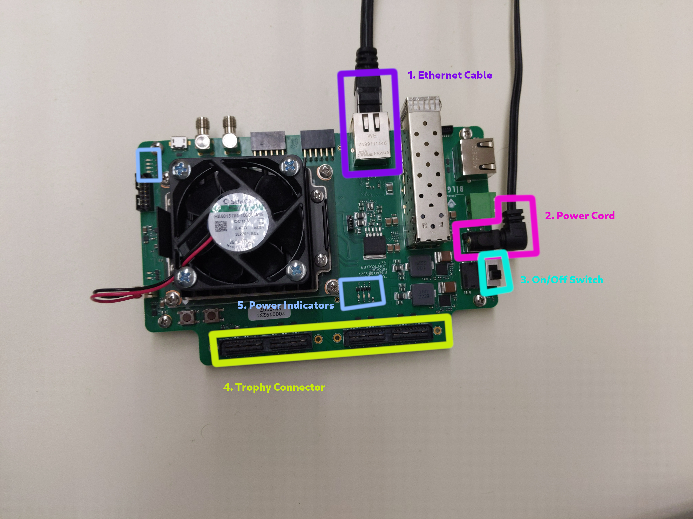

# UA Hexaboard Testing Documentation

## Hardware Introduction

Each testing station is composed of three major componenets.

The **Hexacontroller**, outlined in pink above, contains an embedded Linux system capable of outputting signals on pins, and connected to the internet via an Ethernet cable. Unlike desktops and laptops, the Hexacontroller uses a microSD card to store data. Under normal circumstances, software on the Hexacontrollers is setup by students and should not need to be modified.

Connected to the Hexacontroller is the **Trophy**, outlined above in purple. Sitting above both the Hexacontroller and Hexaboard, the trophy board acts as a wire connecting the two boards together. When connecting to the Hexaboard, pressure may need to be applied. The boards will audibly snap together when connected. Together, the Hexacontroller and Trophy compose the testing instrumentation.

Lastly, outlined above in cyan is the **Hexaboard**. An assembled yet unfinished PCB, this is the board that will be sent onwards to an assembly center to recieve a silicone sensor and eventually find its way to the collider at CERN. This is the only board that will be exchanged between testing cycles.

### The Hexacontroller

Highlighted in purple, the hexacontroller's **ethernet port** is connected directly to our network switch located under the desk. When troubleshooting, it is important to note that only the highlighted ethernet port is functional. A cable connected to the second port will yield no output.

In pink, the **power cable** is terminated with a barrel jack. Connected to mains voltage is a 9v 2.2A adapter. The entier cable is one piece. Any two-part cables or cables labelled "Dell" are likely to be a computer power cable, and thus at a different voltage. Plugging a PC power cable into a hexacontroller will likely damage the controller.

In cyan, the **on-off switch** is highlighted. When connected and powered, green **power indicator LEDs** indicators will be lit on the upper-left of the hexacontroller. After powering on, the controller will take at least one minute to connect to ethernet.

In purple is the **trophy port**. While the trophy can be screwed into place, on most test stations it will likely be removable. Press the trophy firmly into the hexacontroller to connect the two.

When a hexaboard is connected to the controller and power is enabled, the **central power indicator LEDS** will be blue.

### The Hexaboard

On the left of this image, we can see an annotated hexaboard.

Hilighted in purple are the **HGROC** chips. While the sensor may output approximately two hundred channels, the sensor data is read by three HGROC chips which process approximately 80 channels each.

In cyan is the **LD Loopback** chip, which enables board readout. In the detector, the trophy would connect multiple boards to one FPGA, with an additional connection to indicate to a board what position in the lineup it occupies. This function is instead performed by our loopback chip. The chip should be oriented such that the hole in the chip aligns with the support pillar on the board.

In pink is the **compression ports** that connect to the trophy. A fair amount of pressure will be required to connect the two boards, which will join with an audible snap.

To the right of the image in black is the board's **spacer**. As the hexacontroller and trophy are elevated, the hexaboard also needs to be elevated. The spacer fills this purpose. With height adjusted by screws, this board will raise the board to the proper height. Note that this board does not have rotation synmetry. The gap in the retaining wall should be oriented to allow clearance for the trophy.

### Board Orientation

The proper orientation of the board is on the left.

## Software Introduction

Each desktop is connected to multiple hexacontrollers. In the **Testing Data** section, the user will be expected to identify the specific hexaboard connected to each hexacontroller as well as the individual HGROC chips on each hexaboard.

The Testing Data section supports USB Barcode Scanners. With your cursor in a text field, upon scanning a barcode, the cursor will automatically move to the next text box.

Below the data entry columns is a "Start Test" button, which will power on and configure the hexacontroller, and then run a series of tests. When a test is in-progress, the column will self-disable.

Next, the **test log view** is visible. Separated into tabs, this window will display the log of each test in real-time.

Lastly, the **Controller Status** view is a live visualization of each hexacontroller, as well as the services on each. A green LED indicates a valid response, while a red LED indicates an error. A blue LED is only present when the test did not run, likely due to an error in a previous test.

## Electrical Testing Prodecure

1. Verify that the [hexacontroller](#the-hexacontroller) is ready to accept a hexaboard. In this state, the controller should be switched on, but not powering the trophy. The Power Indicator LEDs in the upper-left should be lit green, and the central LEDs should be unlit.

2. Place the [hexaboard](#the-hexaboard) in a riser. Then, connect the trophy to the hexaboard. Ensure that proper [board orientation](#board-orientation) is maintained. Verify that the trophy has not become disconnected from the hexacontroller. When placed appropriately, the riser's retaining walls should not impede the trophy.

3. Attach an L3 Loopback board to the hexaboard. When attached appropriately, the hole in the loopback board should align with a cylindical column attached to the hexacontroller. The board should not overlap with the trophy.

4. Verify the Power Supply is disabled. Then, connect the appropriate power cable to the hexaboard. The label on the power cord should match the label of the hexacontroller.

5. In the [Module Testing GUI](#software-introduction), select the text field for the board ID. Then, using the barcode scanner, scan the barcode on the board. The cursor should then advance to the HGROC fields, which should then be scanned accordingly.

6. Verify that the hexacontroller is ready to start testing. In the GUI, the controller should indicate a green status light for "Connected" and "Zynq".

7. Click "Start Test". The column will disable. During the test, the central power indicator LEDs will be lit blue. Once the test is finished, the column will re-enable.

8. Verify the hexacontroller is no longer powering the hexaboard. The central power indicator LEDs should no longer be lit blue.

9. Disconnect the hexaboard from the L3 Loopback and the trophy. Place the hexaboard in the completed boards area.